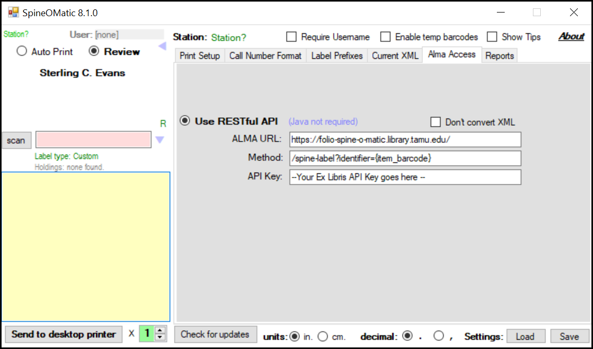
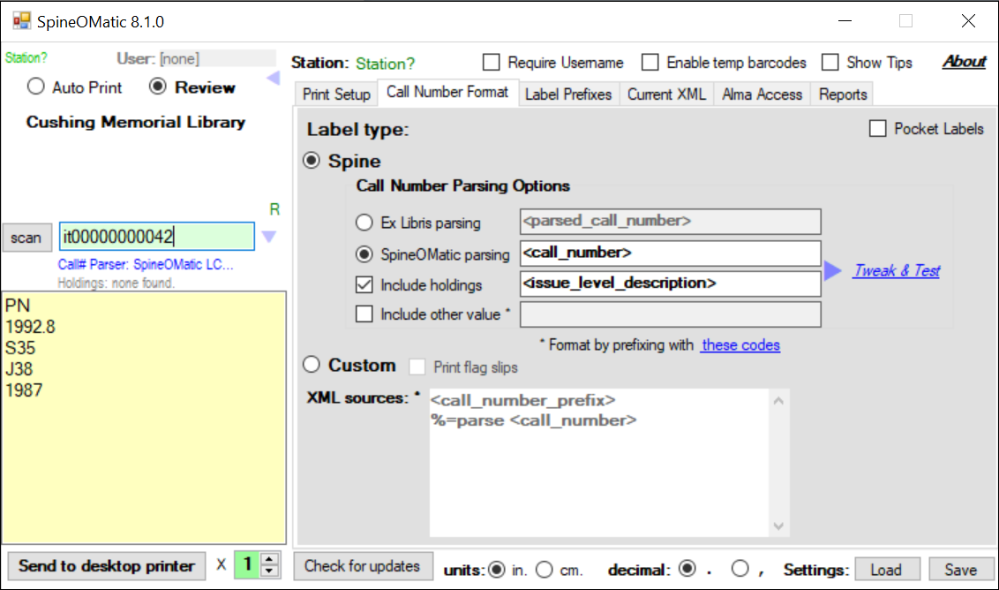
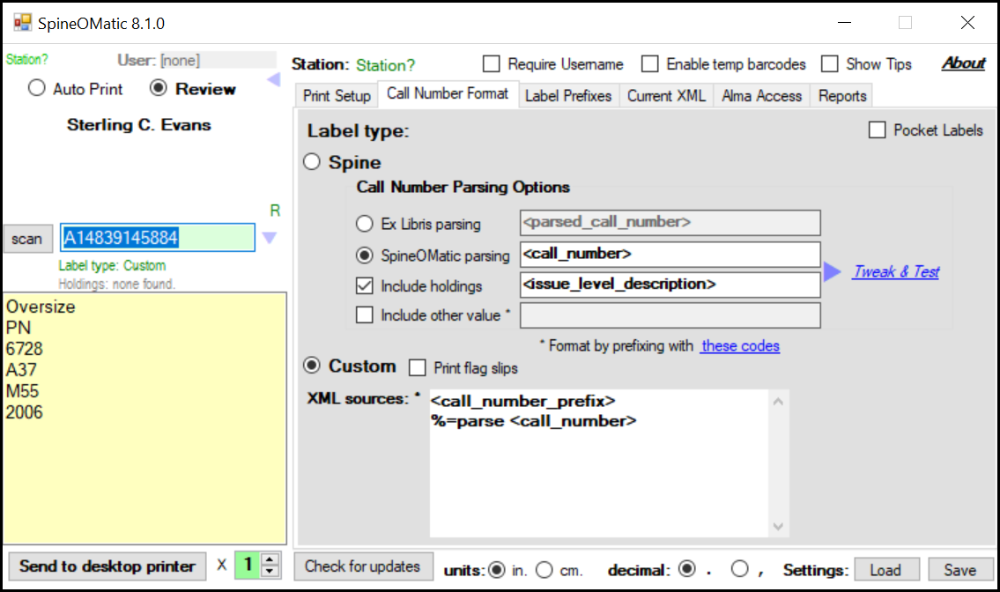

# mod-spine-o-matic

A middleware module for providing Alma like XML responses for use with [SpineOMatic](https://github.com/ExLibrisGroup/SpineOMatic).

Copyright (C) 2018 The Open Library Foundation

This software is distributed under the terms of the Apache License, Version 2.0.
See the file ["LICENSE"](LICENSE) for more information.

## API

There is a single endpoint `/spine-label?identifier={item barcode|item hrid}`.

## Sample use with SpineOMatic

Configure Alma Access to mod-spine-o-matic



Use default call number parsing



Use custom label



### available XML fields

```
<title>
<call_number_prefix>
<call_number>
<call_number_type_name>
<call_number_type>
<enumeration>
<chronology>
<issue_level_description>
<library_name>
<library_code>
<location_name>
<location_code>
<location_gloss>
<current_date>
```

### seperate call number prefix
| barcode      | hrid          |
| ------------ | ------------- |
| A14839145884 |               |

Custom

XML sources:
```
<call_number_prefix>
%=parse <call_number>
```

A14839145884
```
Oversize
PN
6728
A37
M55
2006
```

### enumeration and chronology populated
| barcode      | hrid          |
| ------------ | ------------- |
| A14811944997 | it00000000005 |
| A14814371046 | it00000000006 |
| A14812022756 | it00000000007 |

Custom

XML sources:
```
%=parse <call_number>
<chronology>
<enumeration>
```

A14811944997
```
SB
450.9
N45
1987
v.1:no.1-6
```

A14814371046
```
SB
450.9
N45
1987
v.1:no.7-12
```

A14812022756
```
SB
450.9
N45
1988
v.2
```

### enumeration null, chronology populated
| barcode      | hrid          |
| ------------ | ------------- |
| A14809369076 | it00000663749 |
| A14809369084 | it00000663750 |
| A14809369092 | it00000663751 |

Custom

XML sources:
```
%=parse <call_number>
<chronology>
```

A14809369076
```
TK
454.2
I15
1985:v.1
```

A14809369084
```
TK
454.2
I15
1985:v.2
```

A14809369092
```
TK
454.2
I15
1985:v.3
```

### enumeration populated, chronology null
| barcode      | hrid          |
| ------------ | ------------- |
| A14809356455 | it00000663732 |
| A14809356463 | it00000663733 |
| A14809356471 | it00000663734 |

Custom

XML sources:
```
%=parse <call_number>
<enumeration>
```

A14809356455
```
PQ
6089
C37
1982
v.1:pt.a
```

A14809356463
```
PQ
6089
C37
1982
v.2
```

A14809356471
```
PQ
6089
C37
1982
v.3
```

### barcode is null, so input hrid
| barcode      | hrid          |
| ------------ | ------------- |
|              | it00000165938 |
|              | it00000000042 |
|              | it00000165945 |

Spine

SpineOMatic parsing `<call_number>`

it00000165938
```
Z
1006
C6
```

it00000000042
```
PN
1992.8
S35
J38
1987
```

it00000165945
```
Z
1006
C37
1966
```

### location requiring special label printing
| barcode      | hrid          | location_name |
| ------------ | ------------- | ------------- |
| A14823400064 | it00000498821 | mtxt,film     |
| A14823883296 | it00000498822 | mtxt,film     |
|              | it00000831473 | cush,wode     |
|              | it00000748781 | cush,wode     |
| A14809478998 | it00000667357 | wein          |
| A14809479009 | it00000667360 | wein          |
|              | it00002821308 | cush,afri     |
|              | it00002821372 | cush,afri     |
|              | it00002821509 | cush,afri     |
|              | it00002933250 | cush,asia     |
|              | it00002933253 | cush,asia     |
|              | it00002690836 | cush,asia     |

Custom

XML sources:
```
%=parse <call_number>
<location_gloss>
```

A14823400064
```
BR
1
C6418
MTXT FILM
```

A14823883296
```
BR
1
C6418
MTXT FILM
```

it00000831473
```
PR
6029
R8
D5
Lit./Wodehouse
```

it00000748781
```
PZ
3
W817
Com
Lit./Wodehouse
```

A14809478998
```
PR
6001
B7
A17
1977
WEIN
```

A14809479009
```
PS
3513
I74
K3
1986
WEIN
```

it00002821308
```
E
184
A1
M63
Area Studies/Africana
```

it00002821372
```
PS
3561
A84
Z95
1989
Area Studies/Africana
```

it00002821509
```
E
185.61
W69
1944
Area Studies/Africana
```

it00002933250
```
PL
998
U52
S25
2003
Area Studies/Asian
```

it00002933253
```
PS
508
K67
S87
2003
Area Studies/Asian
```

it00002690836
```
JQ
1506
M5
G68
2004
Area Studies/Asian
```

## Additional Information

Other [modules](https://dev.folio.org/source-code/#server-side).

Other FOLIO Developer documentation is at [dev.folio.org](https://dev.folio.org/).

## Docker deployment

When deploying docker, be sure to set the appropriate ports for your environment (make the guest port matches the port specified in `src/main/resources/application.yml` file).
In the example below, the `-p 9000:9000` represents `-p [host port]:[guest port]` with *guest* referring to the docker image and *host* referring to the system running docker.

```
docker build -t folio/mod-spine-o-matic .
docker run -d -p 9000:9000 folio/mod-spine-o-matic
```

### Publish docker image

```
docker login [docker repo]
docker build -t [docker repo]/folio/mod-spine-o-matic:[version] .
docker push [docker repo]/folio/mod-spine-o-matic:[version]
```

### Issue tracker

See project [FOLIO](https://issues.folio.org/browse/FOLIO)
at the [FOLIO issue tracker](https://dev.folio.org/guidelines/issue-tracker/).
